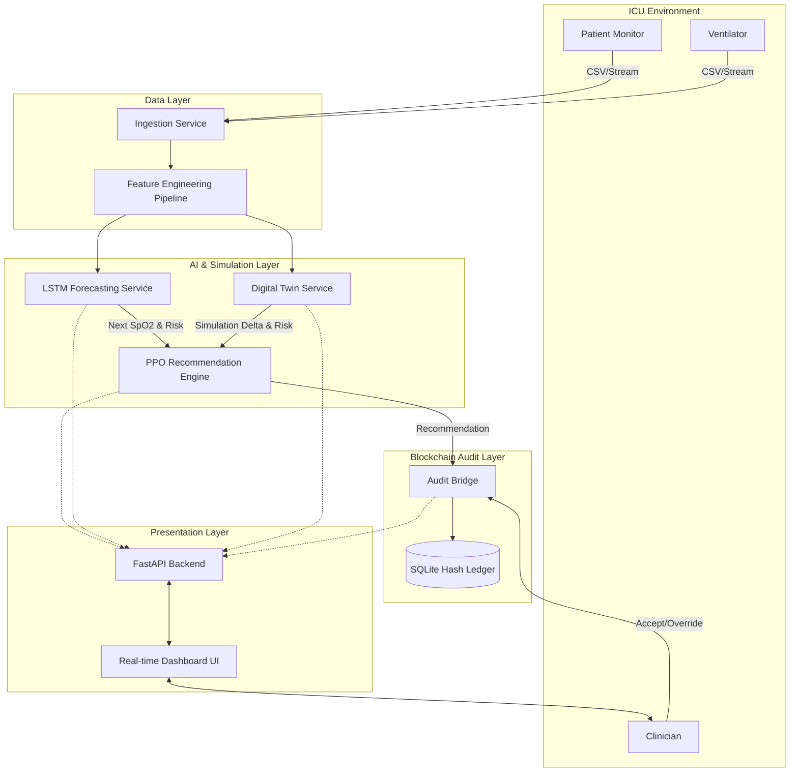
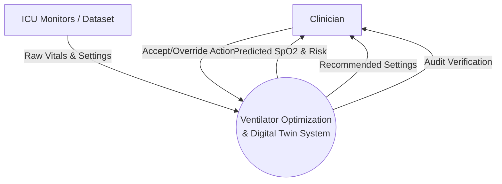
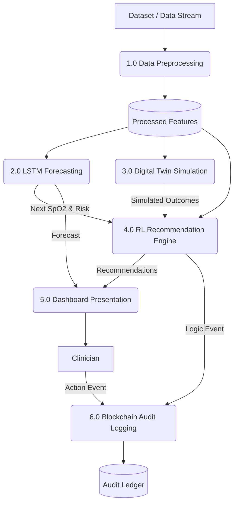
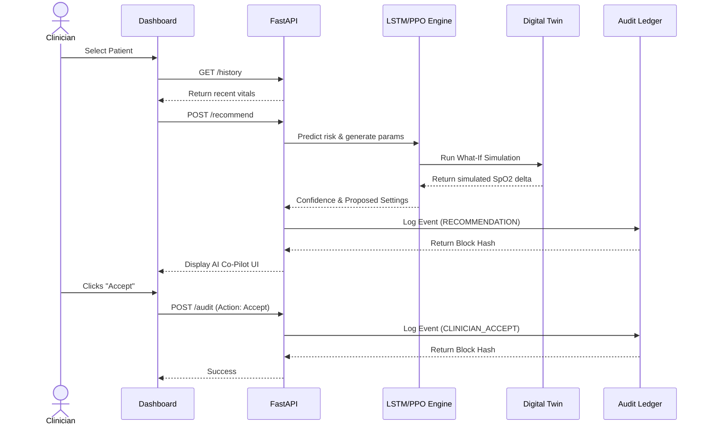
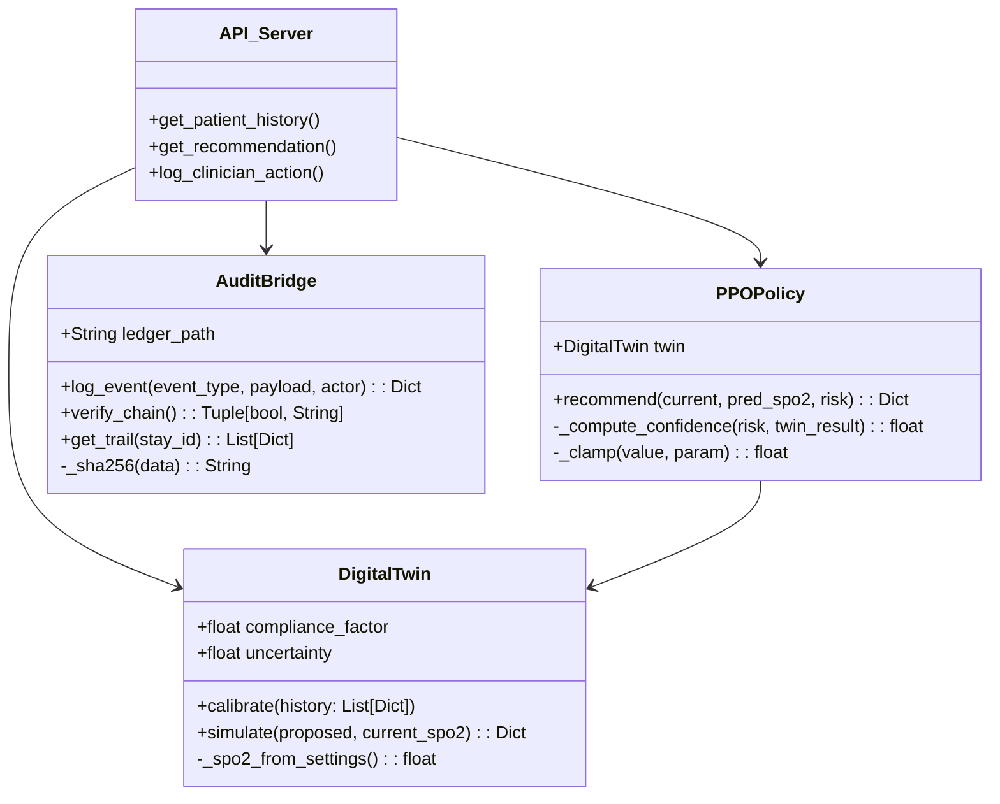

# System Architecture & Diagrams

## 1. System Architecture (Component View)



---

## 2. Data Flow Diagram (DFD)

### Level 0: Context Diagram



### Level 1: Main Process



---

## 3. UML Diagrams

### Use Case Diagram

```mermaid
usecaseDiagram
    actor Clinician
    actor "System/PPO" as System
    
    Clinician --> (View Patient Trajectory)
    Clinician --> (Review AI Recommendation)
    Clinician --> (Accept Recommendation)
    Clinician --> (Override Recommendation)
    Clinician --> (Verify Audit Chain Integrity)
    
    System --> (Generate Risk Forecast)
    System --> (Simulate Digital Twin)
    System --> (Propose Parameter Tweaks)
    System --> (Write Cryptographic Hash to Ledger)
```

### Sequence Diagram: Recommendation & Audit Flow



### Class Diagram: Core Backend Logic


