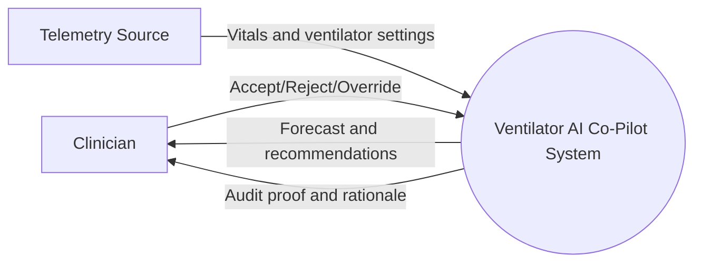
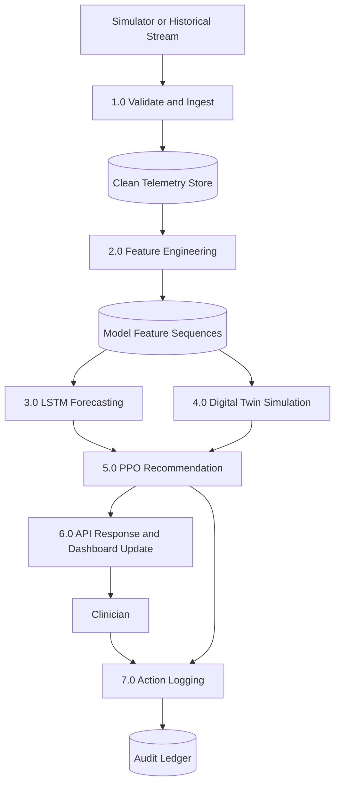

# Data Flow Diagram (DFD)

## Context Level (Level 0)

```mermaid
graph LR
    CL[Clinician]
    DS[Telemetry Source]
    SYS((Ventilator AI Co-Pilot System))

    DS -->|Vitals and ventilator settings| SYS
    SYS -->|Forecast and recommendations| CL
    CL -->|Accept/Reject/Override| SYS
    SYS -->|Audit proof and rationale| CL
```

## Level 1 Process Flow

```mermaid
graph TD
    SRC[Simulator or Historical Stream] --> P1[1.0 Validate and Ingest]
    P1 --> D1[(Clean Telemetry Store)]
    D1 --> P2[2.0 Feature Engineering]
    P2 --> D2[(Model Feature Sequences)]
    D2 --> P3[3.0 LSTM Forecasting]
    D2 --> P4[4.0 Digital Twin Simulation]
    P3 --> P5[5.0 PPO Recommendation]
    P4 --> P5
    P5 --> P6[6.0 API Response and Dashboard Update]
    P6 --> CLN[Clinician]
    CLN --> P7[7.0 Action Logging]
    P5 --> P7
    P7 --> D3[(Audit Ledger)]
```
