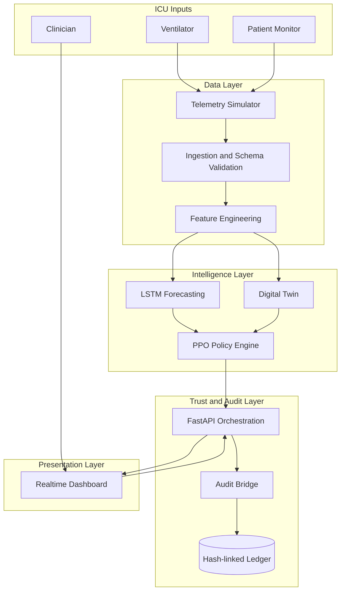

# System Architecture Diagram

```mermaid
graph TD
    subgraph ICU_Inputs[ICU Inputs]
        V[Ventilator]
        PM[Patient Monitor]
        CL[Clinician]
    end

    subgraph Data_Layer[Data Layer]
        SIM[Telemetry Simulator]
        ING[Ingestion and Schema Validation]
        FE[Feature Engineering]
    end

    subgraph Intelligence_Layer[Intelligence Layer]
        LSTM[LSTM Forecasting]
        DT[Digital Twin]
        PPO[PPO Policy Engine]
    end

    subgraph Trust_Layer[Trust and Audit Layer]
        API[FastAPI Orchestration]
        AB[Audit Bridge]
        LEDGER[(Hash-linked Ledger)]
    end

    subgraph Presentation[Presentation Layer]
        DASH[Realtime Dashboard]
    end

    V --> SIM
    PM --> SIM
    SIM --> ING --> FE
    FE --> LSTM
    FE --> DT
    LSTM --> PPO
    DT --> PPO
    PPO --> API
    API --> DASH
    CL --> DASH
    DASH --> API
    API --> AB --> LEDGER
```
