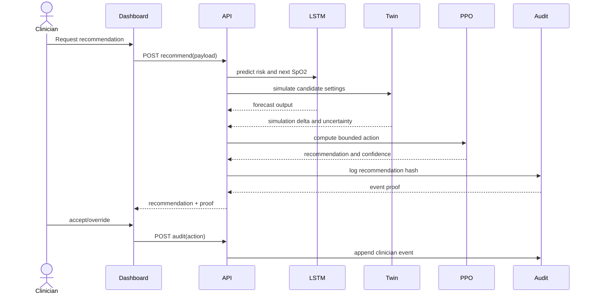
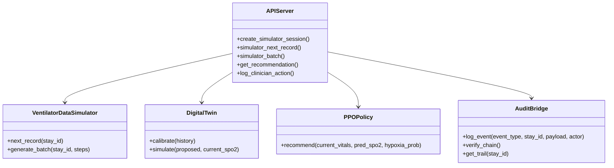

# UML Diagrams

## Use Case Diagram

```mermaid
usecaseDiagram
    actor Clinician
    actor System

    Clinician --> (View Patient State)
    Clinician --> (Review Recommendation)
    Clinician --> (Accept or Override Recommendation)
    Clinician --> (Inspect Audit Trail)

    System --> (Ingest Telemetry)
    System --> (Forecast Risk)
    System --> (Run Twin Simulation)
    System --> (Generate PPO Action)
    System --> (Write Audit Event)
```

## Sequence Diagram: Recommendation Cycle



## Class Diagram: Core Components


